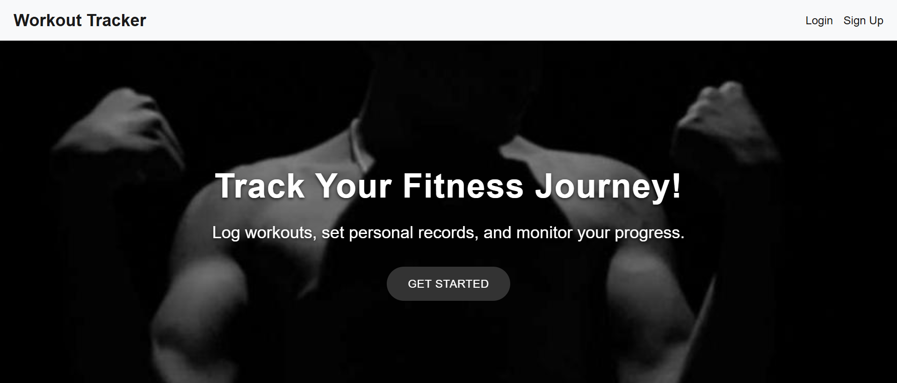
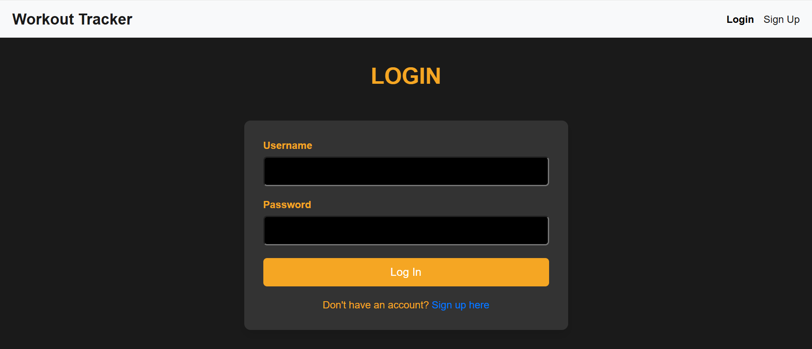
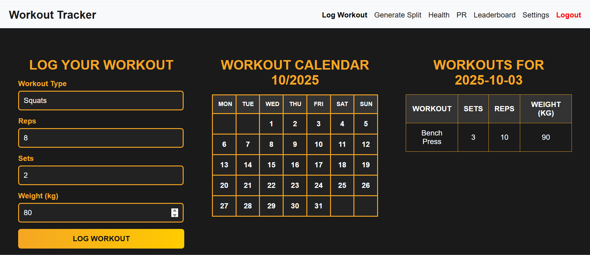
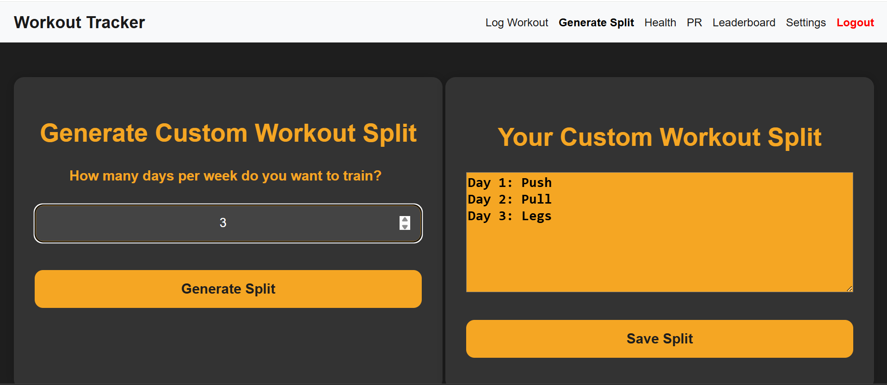
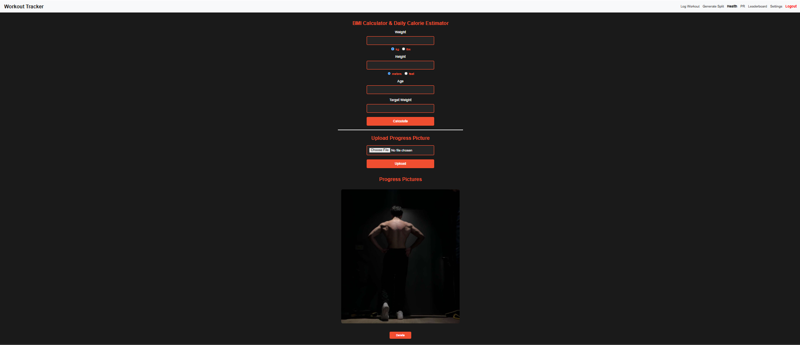
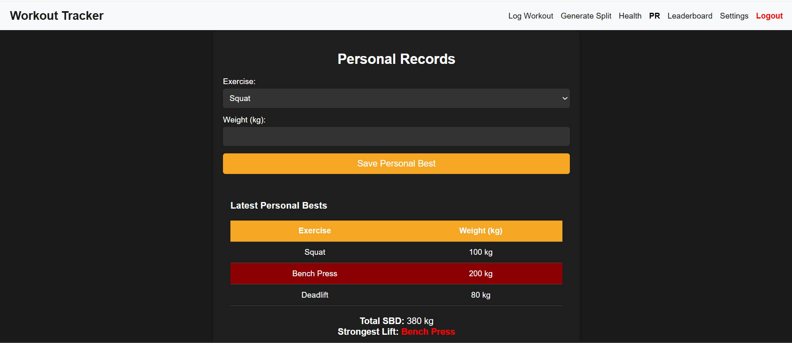
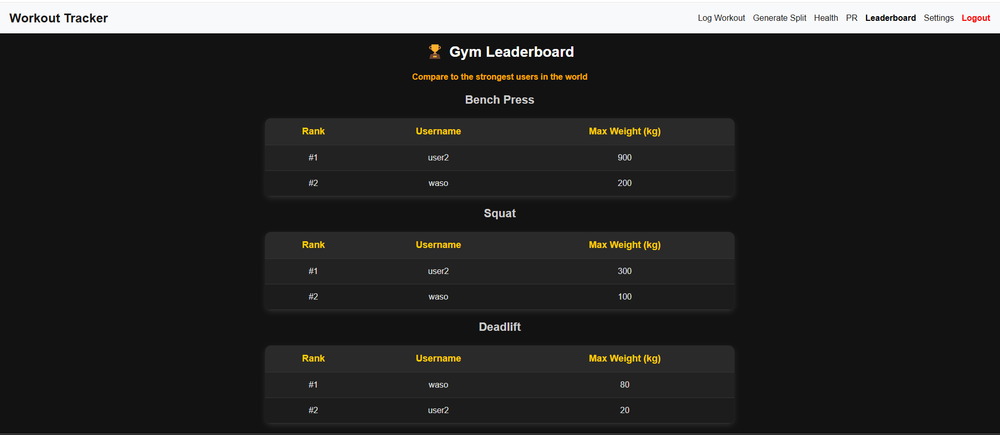

<h1 align="center">🏋️‍♂️ Gym Workout Tracker</h1>

---

## 📋 Table of Contents

- 🔍 [Overview](#overview)
- 🧰 [Tech Stack](#tech-stack)
- ⚙️ [Installation](#installation)
- 🖼️ [Screenshots](#screenshots)

---

## 💡 Overview

The **Gym Workout Tracker** is a full-featured web application that allows users to take complete control of their fitness journey — from workout tracking to progress visualization.

Developed as part of a **university coursework project**, this app provides an all-in-one fitness dashboard where users can:

- 🧍‍♂️ **Create accounts and securely log in** with password protection.
- 📅 **Track daily workouts** by selecting specific dates on a built-in calendar — all logs are saved in the database and displayed dynamically.
- 🏋️‍♀️ **Build a custom workout split**, choose the number of training days per week, and edit each workout to match personal preferences.
- ❤️ **Monitor health stats** such as BMI through an interactive health form.
- 📸 **Upload and view gym progress photos** for future reference.
- 🏆 **Record personal records (PRs)** for powerlifting exercises — **Squat, Bench Press, and Deadlift** — and compare results on a live **leaderboard** with other users.
- ⚙️ **Manage account settings**, including password updates and profile modifications.

This app serves as a complete example of how a modern web application can combine fitness tracking, social features, and data visualization into a seamless experience.

---

## 🧰 Tech Stack

<div align="center">

| Layer | Technology |
|-------|-------------|
| **Frontend** | HTML, CSS, Jinja2 templates |
| **Backend** | Flask (Python) |
| **Database** | SQLite |

</div>

---

## ⚙️ Installation

Follow these steps to run the **Gym Workout Tracker** locally:

1. **Download the repository**
- Click **Code → Download ZIP**
- Extract the ZIP file to a folder on your computer

2. **Install dependencies**
```bash
pip install -r requirements.txt
```

3. **Run the app**
```bash
python app.py
```

4. **Open in your browser:**
<a href="http://127.0.0.1:5000/"> http://127.0.0.1:5000/ </a>

---

## 🖼️ Screenshots

### Home Page


### Login / Register


### Log Workout


### Generate Split


### Health / Progress


### Personal Records


### Leaderboard


---


